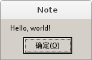

==================================
在 Linux 上学习Win32 API 编程
==================================
:作者: yetist
:邮箱: yetist@gmail.com
:版权: GFDL
:参考: 《结构化文本入门(Karron Qiu)》

现在GNU 软件已经很成熟了，很多企业和个人用户已经开始使用GNU 软件来编写开源或商业软件，这篇教程将试图帮助您使用GNU 软件来开发和编译 win32 应用程序。
在这个教程中，我们将全部使用 linux 下的软件来完成所有的事情，包括软件的编辑，编译和运行。

.. contents:: 索引

准备开发环境
============== 

工欲善其事，必先利其器。要在linux 上使用win32api编程，我们需要先安装相应的工具，以便进行开发。 
需要安装的工具包括：
编译器：mingw32-gcc
链接器：mingw32-binutils
头文件：mingw32-w32api
运行时库：mingw32-runtime
模拟器： wine

在Archlinux 上安装这些软件，你需要运行以下命令：

.. code-block:: bash
 
 $ yaourt -S mingw32-binutils mingw32-gcc mingw32-runtime mingw32-w32api wine

如果你使用的是其它发行版本，则需要查看系统中的包管理软件，使用相应的包管理工具进行安装即可。

OK, 解决了工具问题，我们需要编写一个简单程序来验证它们是否可以正常工作。

第一个程序
============== 

按照惯例，我们将从一个简单的hello，world 程序开始我们的学习之旅。

.Hello World 源代码

.. code-block:: c
  
  #include <windows.h>
  
  int WINAPI WinMain(HINSTANCE hInstance, HINSTANCE hPrevInstance, 
  	LPSTR lpCmdLine, int nCmdShow)
  {
  	MessageBox(NULL, "Hello, world!", "Note", MB_OK);
  	return 0;
  }

将以上代码保存为 hello.c 文件，然后使用以下命令来编译：

.. code-block:: bash
   
  $ i486-mingw32-gcc -o hello.exe hello.c

编译通过，查看一下文件类型，确认它是PE 格式的。

.. code-block:: bash
   
  $ file hello.exe
  hello.exe: PE32 executable (console) Intel 80386 (stripped to external PDB), for MS Windows

嗯，没错，接下来我们使用 wine 来模拟运行::
    $ wine hello.exe

代码说明
============== 

.. code-block:: c
  
  #include <windows.h>
  
包含头文件 windows.h，里面定义了常用的的类型，函数原型说明等内容。

.. code-block:: c
   
  int WINAPI WinMain(HINSTANCE hInstance, HINSTANCE hPrevInstance, 
 	LPSTR lpCmdLine, int nCmdShow)

WinMain():: 是Windows中与DOS或UNIX的main()的等价物．这是你的程开始执行的入口．参数如下:

 HINSTANCE hInstance;; 程序可执行模块的句柄(內存中的.exe文件).
 HINSTANCE hPrevInstance;; 在Win32程序中总是为NULL.
 LPSTR lpCmdLine;; 命令行参数组成的一个单字符串．不包括程序名字．
 int nCmdShow;; 一个将要传递给ShowWindow()的整数，我们在后面进行讨论．

*hInstance* 用作装入资源或其它的以模块为单位的任务．一个模块是一个装入到你程序的exe或dll．对于本教程的大多数部分(如果不是全部的话)，我们只关心一种模块，就是exe模块．

*hPrevInstance* 在Win16时代曾经用作你程序的前面已经运行的实例（如果有的话）．现在已经不用了，在Win32中你忽略它就行了.
调用规则

.. code-block:: c
         
	MessageBox(NULL, "Hello, world!", "Note", MB_OK);

MessageBox():: 调用MessageBox 函数来显示一个对话框。
